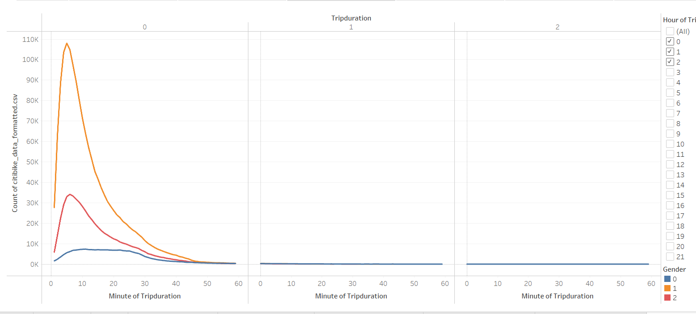
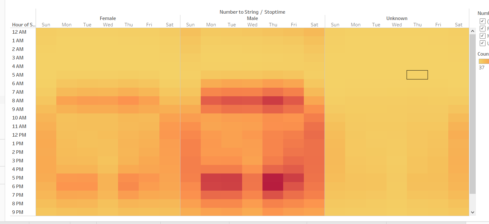

# Pewlett-Hackard-Analysis
## Overview
The purpose of this analysis was to  collect, gather and showcase data for a new startup, related to Citi Bikes.By using previous data from NYC we were able  to format and visualize our data in a neat and clean way for our potential investors. Because they are not technical, tableau provided smart descriptions and easily accessible visualizations to help explain our data, and determine if we would be fit for investors.

## Results
The first visualization that supports the hypothesis that "we need to be invested in" is the Total Customers visualization. Here we can see that our total customers are 2,344,224. We also see that the majority of our customers are subscribers (showcased in orange), so they are REPEAT customers.

Next we have the total number of rides per bike ID. Each bike correlates to an id, and each id is filtered to showcase how many rides have happened on that bike. This is important because it showcases which bikes will need to be repaired as we move into business. When we add new bikes, this will update and track that bikes rides. In the event we use older bikes, we can know that too.

Next we have the Total Bike Checkouts per Hour visualization. Here we can see that the highest amount of time the bikes are used for is around 5 minutes. Based off of this we would want to put our bike stations roughly 7 minutes apart from each other so that they can properly be stored and individuals can reach thier destination in time without causing an issue with our bikes. We also see that a small amount of riders are riding for more than 30 minutes, so having some in the ballpark of that will help too.

Next we have the Total Bike Checkout time compared to the gender that checked out the bike. As we can see mostly, the 1 representing Males was peaked the highest, with female showing up next, and unknown gender being last. We are also able to filter for more trip duration if we want to see if individuals are riding for longer than 2 hours.

The next visualization will cover the Bike Start and stoptimes by hour and day of the week. The x axis, shows us the day of the week, and the y axis shows us the time of day. The darker the purple, the more bikes were checked out at that time. Here we see that Early Thursday mornings, and nights are the most popular times for bike riders in NYC, so we should always try and have our bikes ready to go by then.

Next we have another heatmap that showcases the usage times per gender per hour. The left showcases Female, the middle Male and the right is Unknown. As we can see the largest amount of rides comes from the Males and on a thursday both in the morning and the afternoon. However, the unknown gender type prefers to ride on saturdays between the hours of 8am and 6pm. Females, on the otherhand are distributed very similarly to the males in that they ride around the same time.

Our final visualization showcases the breakdown of weekday vs the usertype and gender. We can see that there are 2 user types and most of them are Subscribers beecause we can see the heatmap shows the darker colors on the bottom of the map. We can also see thtat subscribers prefer to not ride on wednesdays for all genders. Something to note is that all of the distribution of unknown gender prefers to be a customer rather than a subscriber.

## Summary
From all of the visualizations we can tell a couple things. Overall we see that we want to try for the model of subscribers because most of our customer data was skewed towards that. If we use the citi bikes they will range in number of rides and when they need to have repairs, but it is important that we keep track of that in order to replace them. In general, people of all genders, prefer to ride thier bikes for roughly 5 minutes so we should cater our start and stop locations to be within that radius. We should also note that evening times are the most diverse time for riders, so maintenace should happen earlier in the day, before 8 am as this time is also the heaviest amount of time that rides occur.

The first visualization that i would focus on if i needed to add a new one would be the distribution of station id vs how many bikes and rides occur from them. This would tell me on whether or not we need to get rid of a station, or to keep it.

The second visualization that I would create is related to birth year, number of rides, and gender. This would tell me what kind of bikes we can include, if typically younger ages are using our bikes we can include smaller bikes. Or if older folks are using the bikes, we could improve them for comfortability or add a motor for speed.

[link to dashboard](https://public.tableau.com/authoring/Book1_16486813803460/NumberofRides/Investor%20Signoff#1)